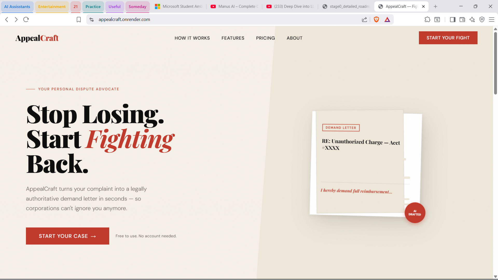
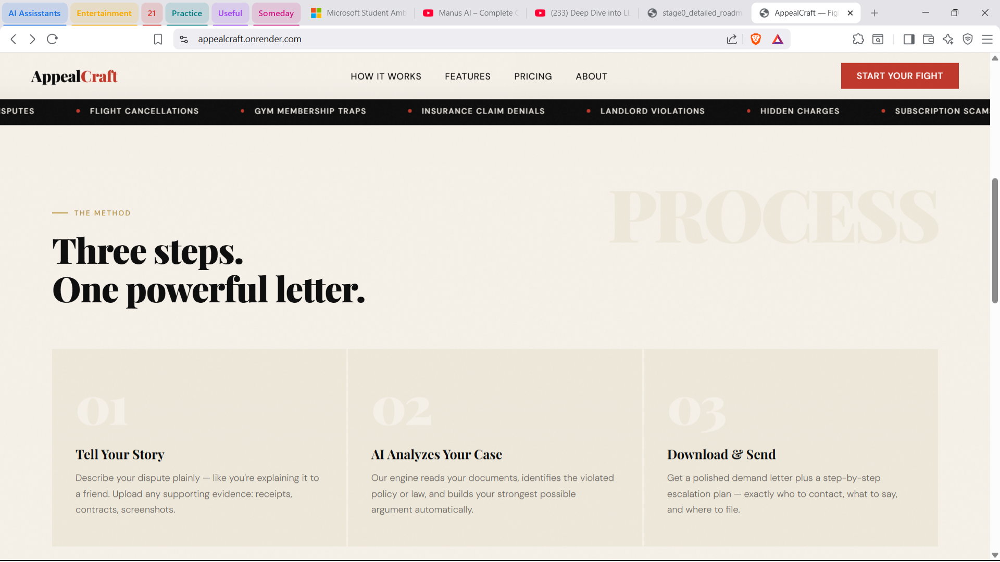
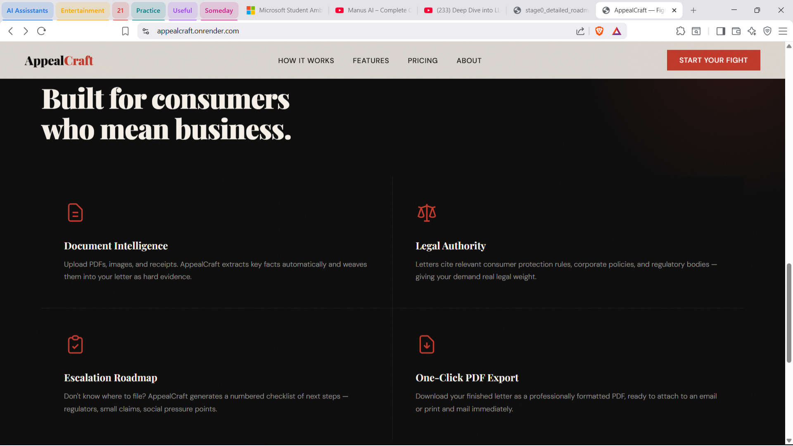
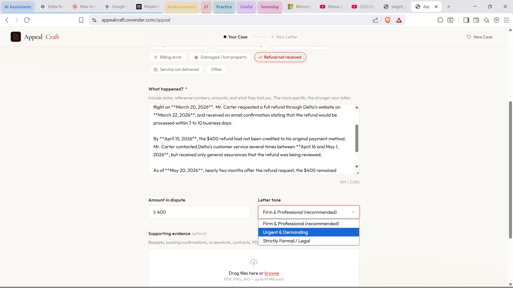
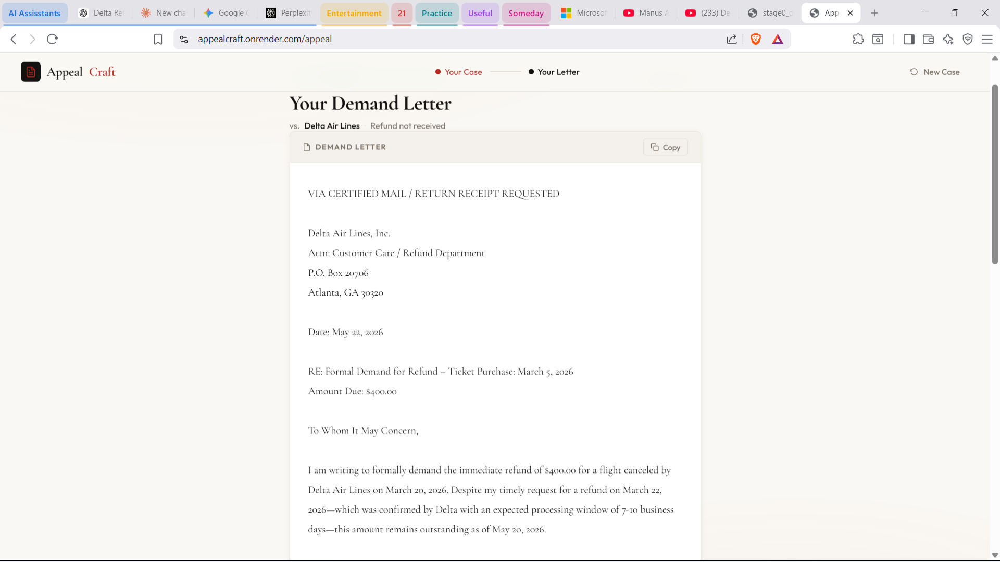
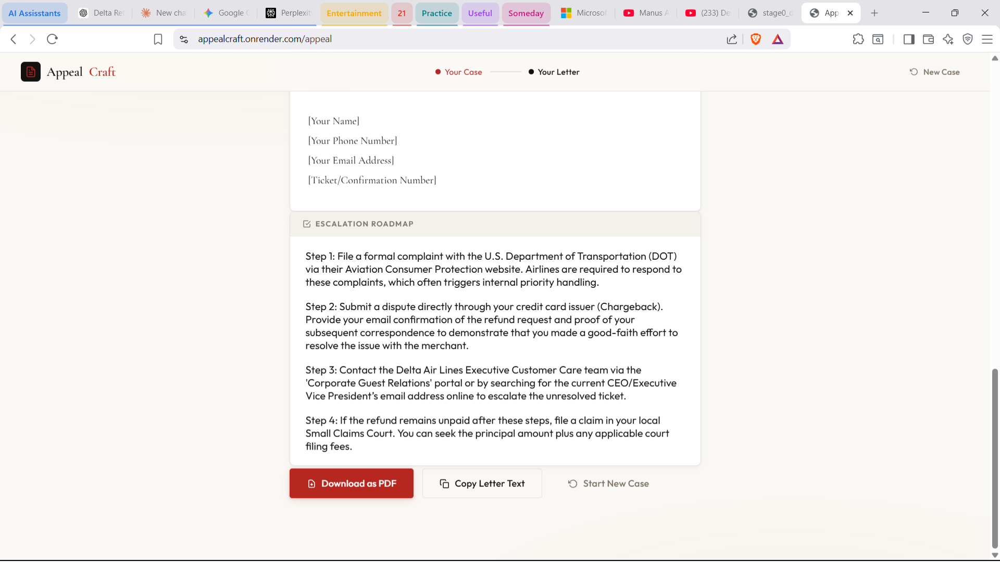

# AppealCraft ⚖️

### _The Personal Dispute Advocate_

AppealCraft is a web application that transforms messy consumer complaints and unstructured documents into professional, legally authoritative demand letters — powered by Google Gemini AI.

Stop accepting "no" for an answer. Describe your dispute, upload your evidence, and get a polished demand letter plus a step-by-step escalation plan in seconds.

---



---

## ✨ Features

- **Plain-language intake** — describe your dispute like you're explaining it to a friend
- **Document & evidence upload** — attach PDFs, PNGs, or JPGs; Gemini reads them natively
- **AI-powered letter generation** — legally authoritative demand letters with the right tone
- **Escalation roadmap** — a numbered checklist of next steps (regulators, small claims, execs)
- **Confidence score** — the AI rates how strong your case is based on the info you provide
- **One-click PDF export** — print-ready letter via the browser's native print dialog
- **Copy to clipboard** — grab the letter text instantly
- **Rate limiting** — 5 requests per minute per IP to prevent API abuse
- **Graceful error handling** — friendly fallback UI if the AI call fails or times out

---

## 🖼️ Screenshots

### Landing Page






### App — Building Your Case



### App — Your Output





---

## 🛠️ Tech Stack

| Layer           | Technology                                  |
| --------------- | ------------------------------------------- |
| Language        | Python 3.11+                                |
| Web Framework   | FastAPI                                     |
| ASGI Server     | Uvicorn                                     |
| LLM Provider    | Google Gemini API                           |
| File Handling   | python-multipart                            |
| Data Validation | Pydantic (bundled with FastAPI)             |
| Rate Limiting   | SlowAPI                                     |
| Env Management  | python-dotenv                               |
| Frontend        | HTML5 + Vanilla CSS                         |
| Frontend Logic  | Vanilla JavaScript (Fetch API)              |
| PDF Export      | Browser native print dialog (iframe method) |
| Version Control | Git + GitHub                                |
| Hosting         | Render.com                                  |

> **Note on file parsing:** PDF and image evidence is sent directly to the Gemini API for native multimodal processing — no server-side OCR or PDF extraction library is used.

---

## 📁 Project Structure

```
AppealCraft/
├── backend/
│   ├── __init__.py
│   └── main.py          # FastAPI app, routes, Gemini API calls
├── prompt/
│   ├── __init__.py
│   └── prompt.py        # System prompt and letter generation template
├── static/
│   ├── css/
│   │   ├── style.css    # Landing page styles
│   │   └── app.css      # App page styles
│   └── js/
│       ├── main.js      # Landing page scripts (ticker, scroll reveal)
│       └── app.js       # App page logic (form, upload, API call, output)
├── templates/
│   ├── index.html       # Landing page
│   └── app.html         # Main app interface
├── docs/                # Screenshots for this README
├── .env                 # API keys (not committed — see setup below)
├── .gitignore
└── requirements.txt
```

---

## 🚀 Getting Started

### Prerequisites

- Python 3.11+
- A [Google Gemini API key](https://aistudio.google.com/app/apikey)

### 1. Clone the repository

```bash
git clone https://github.com/YOUR_USERNAME/AppealCraft.git
cd AppealCraft
```

### 2. Create and activate a virtual environment

```bash
# Windows
python -m venv venv
venv\Scripts\activate

# macOS / Linux
python3 -m venv venv
source venv/bin/activate
```

### 3. Install dependencies

```bash
pip install -r requirements.txt
```

### 4. Set up environment variables

Create a `.env` file in the root directory:

```env
GEMINI_API_KEY=your_gemini_api_key_here
```

### 5. Run the development server

```bash
uvicorn backend.main:app --reload
```

Open your browser at `http://localhost:8000`

---

## 📦 requirements.txt

```
fastapi
uvicorn
python-multipart
google-genai
python-dotenv
pydantic
slowapi
```

---

## 🧪 Example Use Case — Delta Airlines Refund Dispute

The screenshots above show a real end-to-end example:

**Dispute:** Delta Air Lines cancelled a flight on March 20, 2026. The customer requested a refund on March 22 and received email confirmation it would be processed in 7–10 business days. By May 20 — nearly two months later — the $400 refund had still not been credited.

**Inputs used:**

- Company: `Delta Air Lines`
- Dispute type: `Refund not received`
- Amount: `$400`
- Tone: `Urgent & Demanding`

**Output:**

- A formal demand letter addressed to Delta's Customer Care / Refund Department with the correct mailing address, citing the specific dates and the email confirmation as evidence
- A 4-step escalation roadmap including: filing with the U.S. DOT Aviation Consumer Protection division, initiating a credit card chargeback, escalating to Delta executive care, and filing in small claims court

---

## ⚙️ API Reference

### `POST /submit`

Generates a demand letter from a user's dispute details.

**Rate limit:** 5 requests per minute per IP

**Form fields:**

| Field         | Type    | Required | Description                                                                             |
| ------------- | ------- | -------- | --------------------------------------------------------------------------------------- |
| `company`     | string  | ✅       | The name of the company being disputed                                                  |
| `disputeType` | string  | ✅       | Category of the dispute (e.g., Refund not received)                                     |
| `complaint`   | string  | ✅       | The user's plain-text description of what happened                                      |
| `amount`      | integer | ❌       | Dollar amount in dispute                                                                |
| `tone`        | string  | ❌       | Letter tone — `Firm & Professional`, `Urgent & Demanding`, or `Strictly Formal / Legal` |
| `files`       | file(s) | ❌       | Supporting evidence — PDF, PNG, or JPG (max 10 MB each)                                 |

**Response:**

```json
{
  "drafted_letter": "The complete text of the demand letter...",
  "escalation_roadmap": [
    "Step 1: File a formal complaint with the U.S. Department of Transportation...",
    "Step 2: Submit a dispute directly through your credit card issuer..."
  ],
  "confidence_score": 85
}
```

---

## 🌐 Deployment

This app is deployed on [Render](https://render.com) at [appealcraft.onrender.com](https://appealcraft.onrender.com).

To deploy your own instance:

1. Push your code to GitHub
2. Create a new **Web Service** on Render and connect your repo
3. Set the **build command:** `pip install -r requirements.txt`
4. Set the **start command:** `uvicorn backend.main:app --host 0.0.0.0 --port $PORT`
5. Add `GEMINI_API_KEY` under **Environment Variables**

---

## 🔒 Security Notes

- API keys are stored in `.env` and never committed to source control (add `.env` to your `.gitignore`)
- Uploaded files are processed in isolated UUID-named temporary directories and deleted immediately after the Gemini API call completes
- Rate limiting is enforced server-side via SlowAPI at 5 requests per minute per IP, with a proper `429` JSON response

---

## 📄 License

This project is licensed under the MIT License — see [LICENSE](./LICENSE) for details.

---

## 🙏 Acknowledgements

- [Google Gemini](https://deepmind.google/technologies/gemini/) for multimodal AI processing
- [FastAPI](https://fastapi.tiangolo.com/) for the clean, fast Python web framework
- [SlowAPI](https://github.com/laurentS/slowapi) for painless rate limiting
